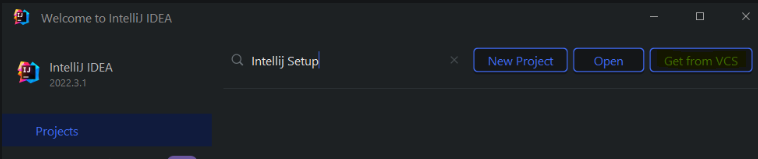
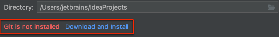
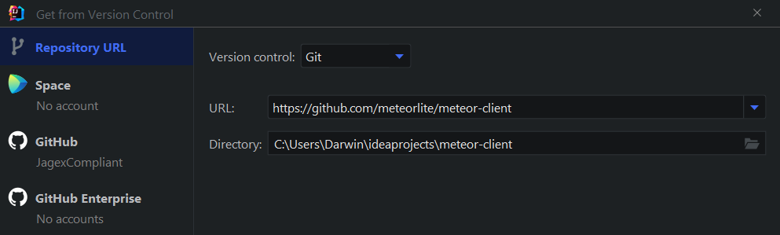
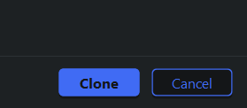
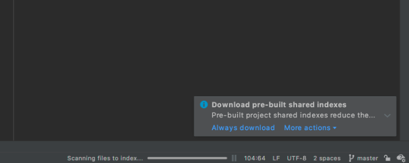
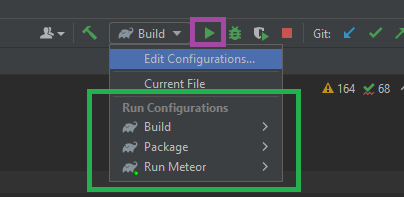
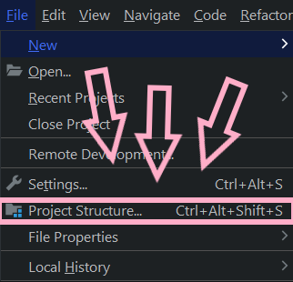
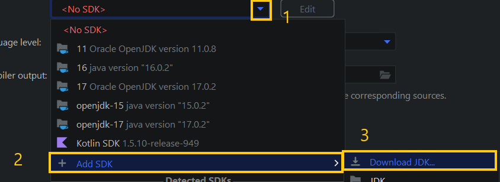
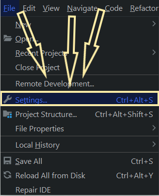
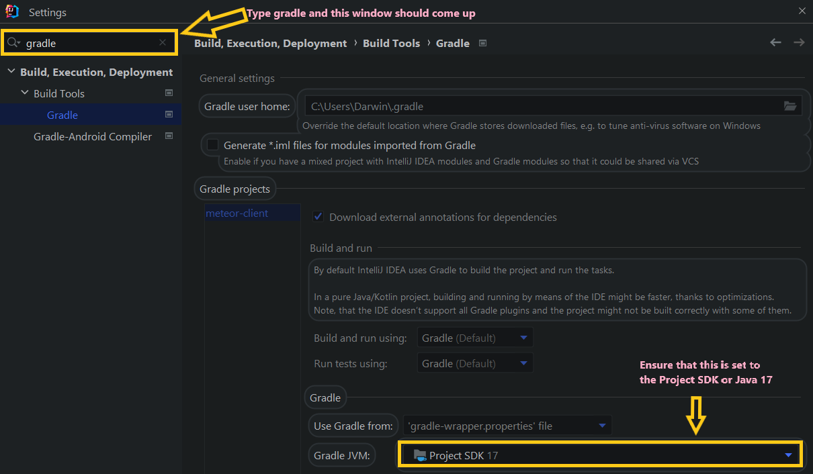

## Requirements
- [Oracle JDK17](https://www.oracle.com/java/technologies/javase/jdk17-archive-downloads.html)
- [Latest IntelliJ](https://www.jetbrains.com/idea/download/)

**During / after importing meteor-client, ensure that the project SDK is using Oracle JDK17**

# Setup Guide

## 1. Clone meteor-client as a Gradle project through version control
1. ### Open Intellij
2. ### Click the icon labeled `Get from VCS`

   

   ## * If Git is already installed skip to step 1.4

3. ### Install `Git` if you have not installed it yet there should be a prompt to install it

   

4. ### Fill in the `URL:` with the meteor client Url as specified in this picture below and set your `Directory:`

   

5. ### Click `Clone` and now wait for the indexing to finish

     

## 2. Build/Run Meteor Client Project
### The following default configurations are included in the project immediately after cloning the project and the indexing has finished

### To launch the client double click 

### **If all went well the client should now be launched**

### If things didn't go so well and you are having some compilation errors here are a few things to check:

* ### Make sure the project SDK version is set to 17 in the project structure

  
  

  ### * You should have Java 17 installed if it doesn't appear in the list you can download it here

  

* ### Check that the gradle Java version is using the project SDK

  
  

# If you are still having problems after carefully going through these steps ask for help in the Discord.
