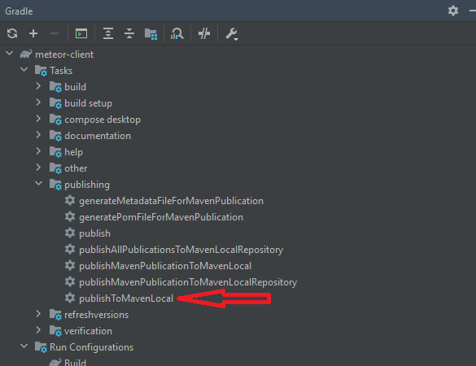
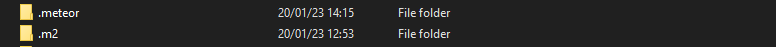
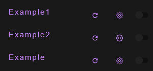
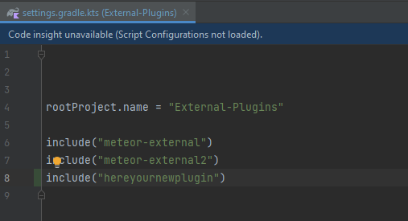

## Requirements

- Having built the client at least once. See [Building/Running with IntelliJ](https://github.com/MeteorLite/meteor-client/wiki/Building-&-Running-With-IntelliJ) for more information.
- Clone [meteor-externals](https://github.com/MeteorLite/meteor-externals) locally

Open meteor-client gradle settings and press `publishToMavenLocal`

This will create an .m2 folder next to the .meteor project

Clone [meteor-externals](https://github.com/MeteorLite/meteor-externals) locally and build the project.

Make sure you went through the `publishToMavenLocal` step before building the meteor-externals project!

When the build is done, you can build meteor-client locally and you should see the example plugins in the plugin list.

Try to make a change in the external plugin, rebuild the plugin in the external project and press the "refresh" button in the plugin list. You should now see the changes live in the client!

## Adding a custom external plugin

Copy the directory of one of the existing example plugins, adjust `build.gradle.kts` to match your new plugin.

Then in the projects `settings.gradle` include your new plugin

Restart the client and you should be good to go! Changes in the plugin will be automatically updated once you build the plugin and press the "refresh" button.
